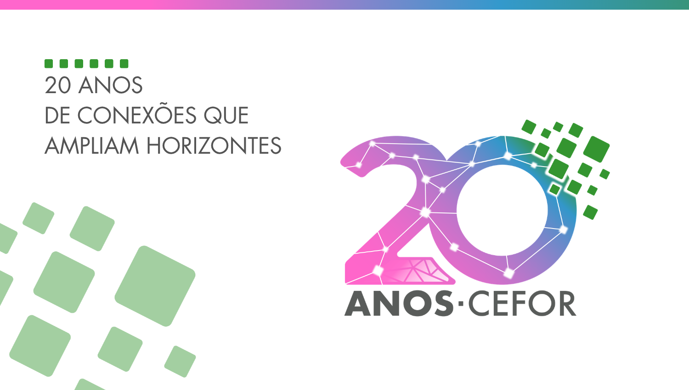

# Design System — Selo 20 anos do Cefor/Ifes

> Identidade **comemorativa**. Entra como **acento** sobre a [base Concefor](../concefor/).
> Marca os 20 anos — é o elemento festivo, vibrante e colorido da edição.

**Fonte:** *Manual de Identidade Visual* oficial do selo
([`assets/manual-identidade-visual.pdf`](assets/manual-identidade-visual.pdf)). **Todos os
valores de cor abaixo são os códigos exatos do manual** — não são amostras nem estimativas.



## Conceito

> *Vibrante e colorido, o selo foi construído a partir da ideia de **diversidade, conexão,
> unicidade, tecnologia e crescimento**.* As cores evidenciam a singularidade, a localização no
> Espírito Santo e a **gestão feminina** ao longo das duas décadas.

**Slogan:** *"20 anos de conexões que ampliam horizontes."*

## Cores (exatas do manual)

| Token | Hex | RGB | CMYK | Significado |
|---|---|---|---|---|
| `--selo-magenta` | `#FF66CC` | 255,102,204 | 13,68,0,0 | Gestão feminina, singularidade |
| `--selo-blue` | `#3399CC` | 51,153,204 | 74,25,7,0 | Tecnologia, conexão |
| `--selo-green` | `#3C9035` | 60,144,53 | 78,19,100,4 | Crescimento, Espírito Santo |
| `--selo-gray` | `#595C5A` | 89,92,90 | 60,47,49,39 | Texto "ANOS·CEFOR" |
| `--selo-green-soft` | `#A8D5A2` | — | — | Malha decorativa (amostrado*) |

\* O verde-claro dos quadrados em diagonal aparece em todas as páginas do manual mas não tem
tabela de cor oficial; valor amostrado.

### Gradiente assinatura (exato)

```css
background: linear-gradient(45deg, #FF66CC 0%, #3399CC 86%, #3C9035 99%);
```

Ângulo **45°** e stops **0% / 86% / 99%** são especificação do manual — não alterar.

## Tipografia

O selo usa **Futura** (bold + medium). Futura é licenciada; substituta web geométrica
recomendada: **Jost** (Google Fonts). Fallback: Century Gothic.

- **Display / títulos:** `Jost` bold
- **Corpo:** `Jost` medium

Padrão recorrente do manual: **eyebrow de quadradinhos** (`▪ ▪ ▪`) acima de títulos em caixa-alta.

## Elementos-assinatura

1. **Malha de quadrados-pixel ascendentes** — crescimento, expansão do conhecimento.
2. **Rede de constelação** — nós luminosos + linhas = conexão.
3. **Eyebrow `▪ ▪ ▪`** sobre títulos caixa-alta.
4. **Quadrados verde-claro** em diagonal como textura de fundo discreta.

## Regras de aplicação (do manual)

- ✅ Versão colorida **só sobre fundo branco**. Em fundos coloridos, usar a versão monocromática.
- ✅ **Reserva de integridade:** margem mínima = `x` (largura da união do "2" com o "0").
- ✅ **Redução máxima:** o número "20" nunca menor que **1 cm / 30 px**.
- ❌ Não rotacionar · não distorcer · não alterar cores · não aplicar moldura · não alterar a
  tipologia · não usar como marca d'água · não reposicionar elementos · não aplicar sobre
  fundos instáveis.

## Como usar no código

```css
@import "../design-system/selo-20-anos/tokens.css";

.selo-eyebrow { letter-spacing: var(--selo-tracking-eyebrow); color: var(--selo-green); }
.selo-accent  { background: var(--selo-gradient); }
```

Tokens também em [`tokens.json`](tokens.json). Veja [`preview.html`](preview.html) para a
demonstração visual. Arquivos do selo (PNG/vetor) e gerador de assinatura: ver
[`links.md`](../../links.md).
